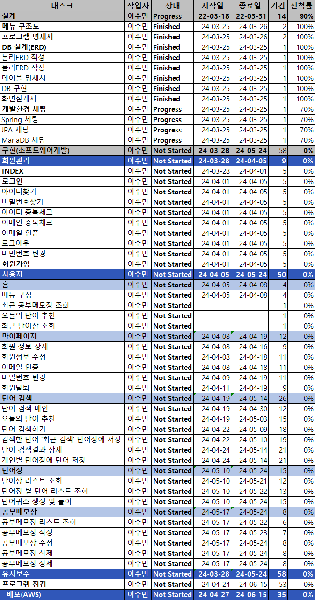

## 프로젝트 WBS

### 회원관리
* INDEX
* 로그인
* 아이디찾기
* 비밀번호 찾기
* 아이디 중복체크
* 이메일 중복체크
* 이메일 인증
* 로그아웃
* 비밀번호 변경
* 회원가입
---

---
---
### 사용자
##### 홈
* 메뉴 구성
* 최근 공부메모장 조회
* 오늘의 단어 추천
* 최근 단어장 조회
---

---
---
##### 마이 페이지
* 회원 정보 상세
* 회원정보 수정
* 이메일 인증
* 비밀번호 변경
* 회원 탈퇴
---
---

##### 단어 검색
* 단어 검색 메인
* 오늘의 단어 추천
* 단어 검색하기
* 검색한 단어 '최근 검색' 단어장에 저장
* 단어 검색결과 상세
* 개인별 단어장에 단어 저장
---

---
---
##### 단어장
* 단어장 리스트 조회
* 단어장 별 단어 리스트 조회
* 단어퀴즈 생성 및 풀이
---

---
---
##### 공부메모장
* 공부메모장 리스트 조회
* 공부메모장 작성
* 공부메모장 수정
* 공부메모장 삭제
* 공부메모장 상세
---

---
---
#### 엑셀 사진
